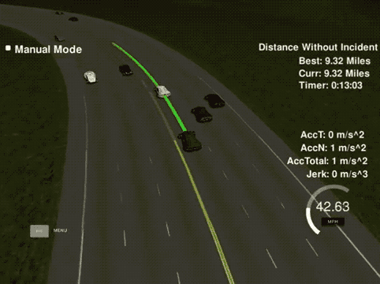
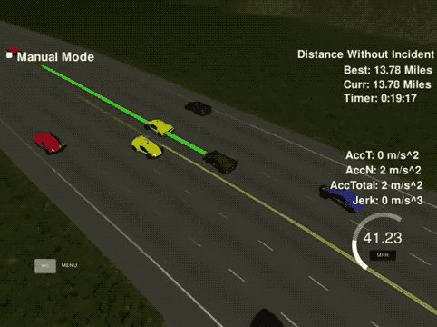
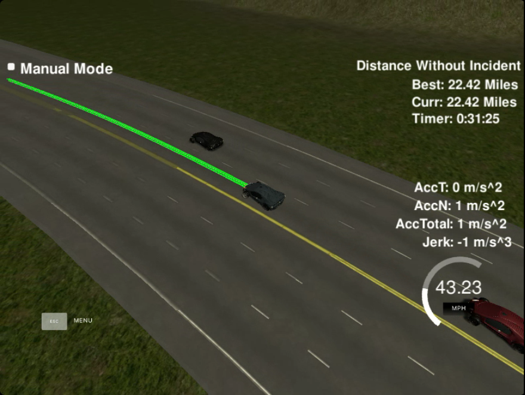

## Path Planning Project - Udacity CarND

[](http://www.udacity.com/drive) 

### Introduction

In this project, the goal is to design a path planner that is able to create smooth, safe paths for the car to follow along a three lane highway with traffic. A successful path planner will be able to keep inside its lane, avoid hitting other cars, and pass slower moving traffic all by using localization, sensor fusion, and map data. At the same time, the car does not exceed a total acceleration of 10 m/s^2 and a jerk of 10 m/s^3.

To satisfy these objectvies, the structure of this path planning algorithm is following 5 steps:

1. Interpolating sparse map waypoints
2. Initializing planners
3. Assigning nearby obstacles information into each planner
4. Jerk-minimizing trajectory generation
5. Selecting optimal trajectory


### Quantitative results





[`Youtube link for full-version`](https://www.youtube.com/watch?v=HFkaWMBQXGM)

### Usage
#### Dependencies
```
cmake >= 3.5
make >= 4.1
gcc/g++ >= 5.4
uWebSockets
```
Please see how to install these dependencies at [original udacity-path-planning repository](https://github.com/udacity/CarND-Path-Planning-Project)

#### Usage
1. Clone this repo.
2. Make a build directory: `mkdir build && cd build`
3. Compile: `cmake .. && make`
4. Run it: `./path_planning`.


## Implementation Details

### Interpolating sparse map waypoints

A given map is recorded at approximately 30m intervals, so you can not obtain smooth tractory by directly using `getXY` function. Therefore, nearby waypoints are interpolated using `spline` function which can create coarse waypoints with 0.1m interval. By doing this we can get more smooth trajectory in global (x,y) coordinates when mapping trajectory in Frenet frame into trajectory in global coordinate.


### Initializing planners

Driving can be very simple on highway unlike driving in urban situation. If you determine which lanes to drive along, you will be able to drive almost the best performance. We leveraged this this thinking. As allocating the planners one for each lane, and each planner creates the best trapectory in each lane. So there are three lanes in this project, and there's a total of three local planners. Each planner contains the following elements :

```c++
typedef struct Planner {
  double target_d;              // target d in Frenet coordinate
  vector<Vehicle> obstacles;    // obstacles on this lane
  Vehicle target_to_follow;     // target vehicle to follow
  int following_target_id;      // id of target vehicle to follow
  double dist_to_target;        // distance to target vehicle
  MatrixXd s_trajectories;      // generated s-trajectories in Frenet
  VectorXd s_costs;             // corresponding s-cost for each trajectory
  MatrixXd d_trajectories;      // generated d-trajectories in Frenet
  VectorXd d_costs;             // corresponding d-cost for each trajectory
  bool obstacle_following;      // if false: velocity keeping
  bool feasible_traj_exist;     // if false: no feasible trajectory
  int optimal_s_id;             // s-trajectory id with minimal s-costs
  int optimal_d_id;             // d-trajectory id with minimal d-costs
  double minimal_cost;          // total minimal cost 
  int iters;                    // how many iterations run to check collision-free trajectory
} Planner;
```


### Assigning nearby obstacles information into each planner

The position and velocity information of the nearby vehicles from the `sensor_fusion` is transmitted to each planner. If the obstacle is currently ahead of the vehicle's position `car_s`, the planner will enter the `obstacle_following` mode to follow the ahead vehicle. In contrast, the `velocity_keeping` mode will operate if there is no obstacle ahead.


### Jerk-minimizing trajectory generation

In the trajectory generation phase, following trajectory and velocity keeping trajectory are generated without considering collision. We have created **5th order polynomial** trajectories that can minimize jerk on the Frenet frame independently for s and d. we considered three type of cost: 

1. Jerk (the smaller is the better)
2. Terminal state (the safe distance to ahead vehicle in s-direction and cross track error in d-direction)
3. Speed (the closer to `max_speed` is the better)

After this process, we designed the *jerk to be smaller* and *the speed to be closer to `max_speed`* to have a smaller cost. Especially,  [Huber Loss](https://en.wikipedia.org/wiki/Huber_loss) is used for the cost to speed up the speed up to` max_speed`. Finally, the total cost is calculated taking into account the longitudinal and lateral sensitivity represented as `klon` and `klat`.

```c++
sd_cost(ss,dd) = klon * planners[i].s_cost[ss] + klat * planners[i].d_cost[dd];
```

For more information on trajectory generation, see *"Optimal Trajectory Generation for Dynamic Street Scenarios in a Frenet Frame",* M. Werling, J. Ziegler, S. Kammel and S. Thrun, ICRA 2010: [Link](https://d17h27t6h515a5.cloudfront.net/topher/2017/July/595fd482_werling-optimal-trajectory-generation-for-dynamic-street-scenarios-in-a-frenet-frame/werling-optimal-trajectory-generation-for-dynamic-street-scenarios-in-a-frenet-frame.pdf)


### Selecting optimal trajectory

In this part, the path-planner selects the collision-free (s, d) trajectory with the lowest cost among the best trajectories of each planner. To accomplish this, the following process is performed:

1. Calculating best collision-free trajectory for each planner
2. Selecting the optimal trajectory with lowest cost among them


#### Calculating best collision-free trajectory for each planner

The best trajectory selection considering collision is done **from a constraint perspective, not from a cost perspective**. That is, the trajectory for which a collide is anticipated is excluded from consideration when selecting the best trajectory in the first place. Collision check assumes the vehicle is a rectangle and proceeds from the low cost trajectory. At each planning horizon, if one of the **squares** representing the vehicle and the opponent carries overlap, it is determined as a collision trajectory and removed from the best trajectory candidates. If the trajectory with the lowest cost is identified as not colliding, the trajectory is selected as the best trajectory to the lane.

CV(Constant Velocity) model was used to predict the position of the opponent vehicle. And we applied the [Seperating Axis Theorem](http://www.dyn4j.org/2010/01/sat/) to check that the squares overlap geometrically.


#### Selecting the optimal trajectory with lowest cost among them

The best trajectory to each lane was determined above. Now, it's time to figure out which lane is best for the vehicle. This process is super easy. Compare the `minimal_cost` of the three planners and select the (s, d) trajectory of the planner with the lowest `minimal_cost` as the final trajectory!


## Conclusion

It is possible to drive without difficulty even with fairly dense traffic, and according to the designed cost, when there is a safe path that guarantees a better speed, the vehicle travels as close to `max_speed` as possible through lane change if there is slow vehicle ahead. As the degree of freedom of the project was high, It was nice to be able to think about various ways to solve the problem.

It is a video that the car drives for about **30 minutes at a distance of about 22 miles** without collision without violating the constraint. Maybe it seems to be able to drive more, but it did not mean much, so it ended in the middle: [Youtube link](https://youtu.be/377zAMZBDjM), [Youtube link for 2x speed](https://www.youtube.com/watch?v=HFkaWMBQXGM)





## Inspirations from ...

- ["Optimal trajectory generation for dynamic street scenarios in a Frenet Frame (Youtube)"](https://www.youtube.com/watch?v=Cj6tAQe7UCY)
- My previous work: ["Intervention minimized semi-autonomous control using decoupled model predictive control"](http://ieeexplore.ieee.org/document/7995787/), H. Kim, J. Cho, D. Kim, K. Huh, IV 2017

